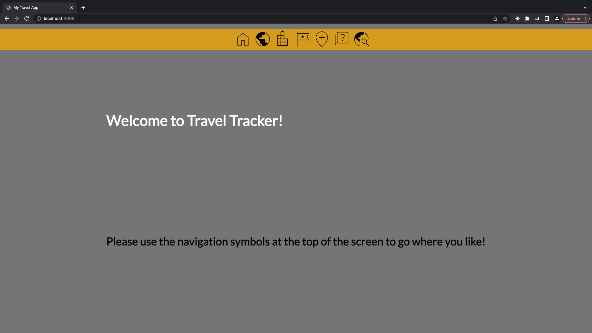

Welcome to Travel Tracker!

This app allows a user to keep track of the countries, cities and sights that they want to visit!

It uses CRUD functionality and RESTful routes.

This app is built using Python and Flask with a PostgreSQL database.

### To run:
 
In terminal:

psql -d travel -f db/travel.sql

python3 console.py

flask run

### Location

The app will be available on localhost:4999